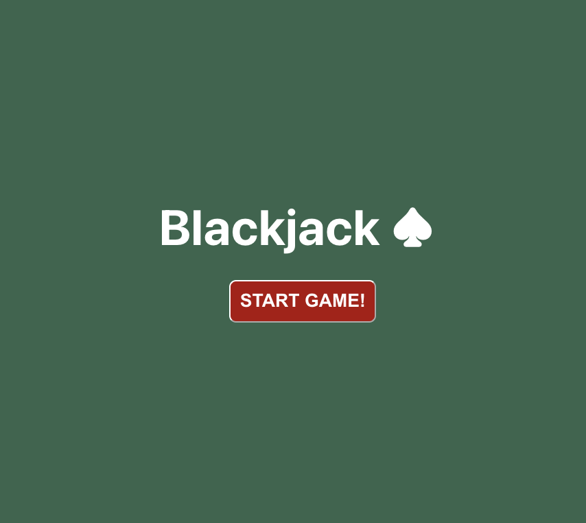
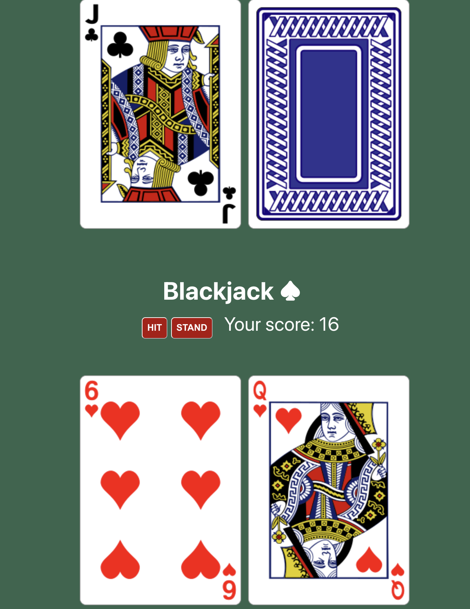
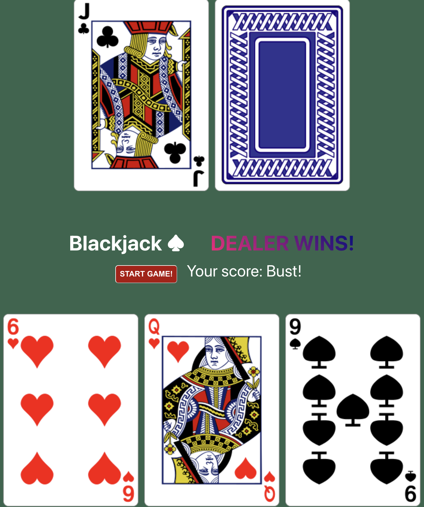
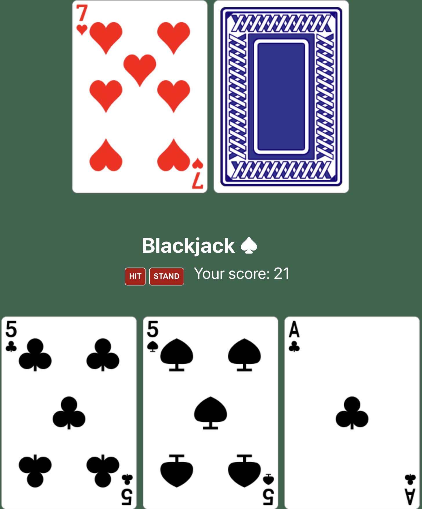
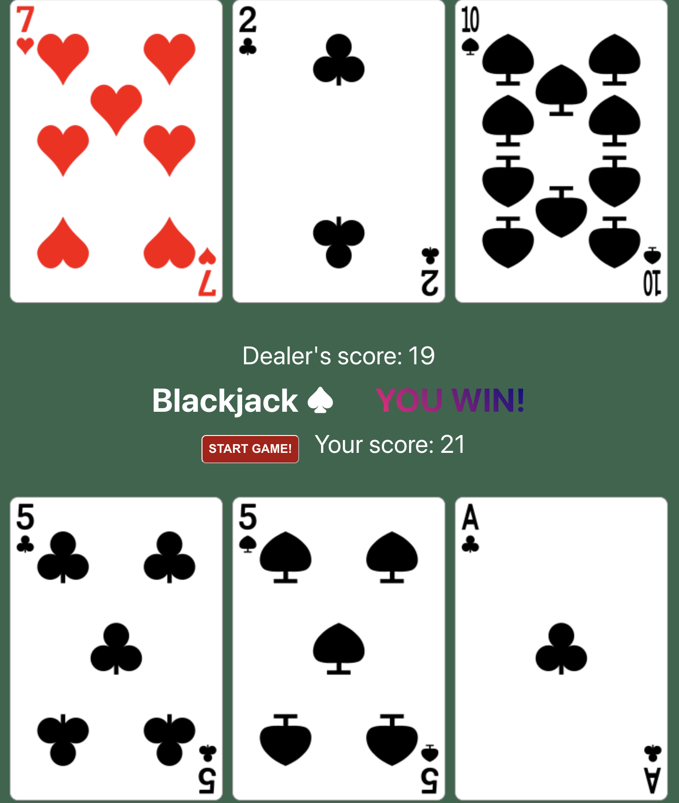
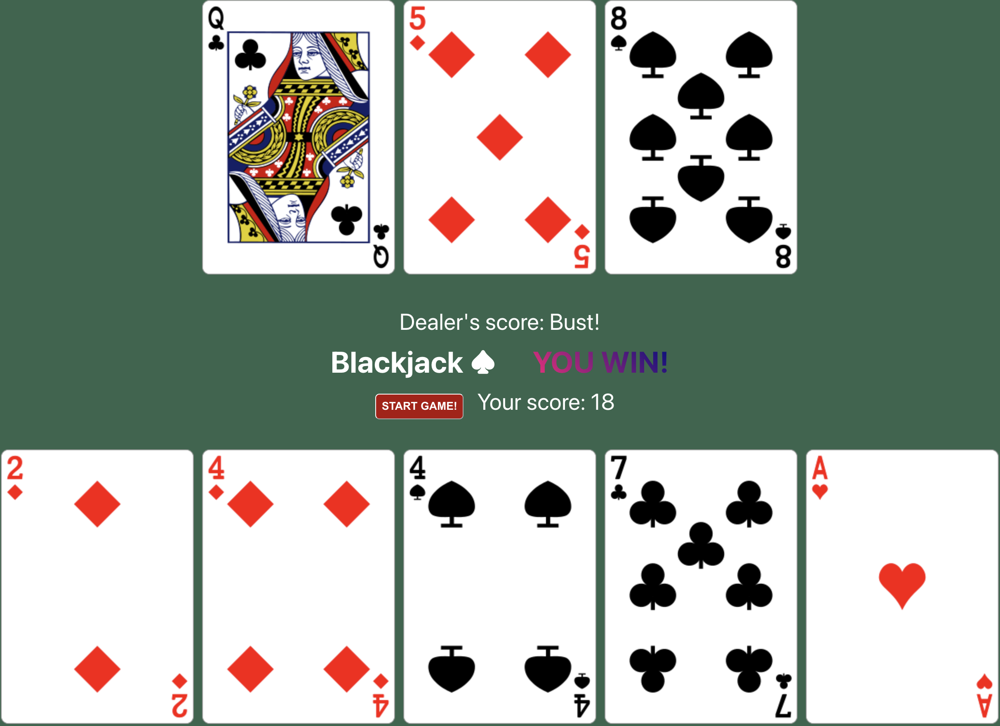

# Blackjack Card Game

Let's play! This is a Blackjack 21 app, written using a mixture of OOP JavaScript and React for some of the rendering. I have made the choice in the code to use a HTML string literals approach for rendering some portions of the UI as a trade-off to minimise some of the complexity that resulted when using the OOP classes alongside React methods like `useState()` and `useEffect()`.

## The Rules of Blackjack

- Blackjack hands are scored by their point total.
- The hand with the highest total wins, if it doesn't exceed 21. A hand with a higher total than 21 is considered a bust.
- Cards numbered 2 through 10 are worth their face value.
- Face cards (jack, queen, king) are each worth 10 points.
- An ace can be worth 11 points if it doesn't cause the player to bust. If it would cause a bust, it is worth 1 point.

## Requirements

Create a simple user interface (UI) for the game. The UI should allow the player to:

- Start a new game.
- See their current hand and point total.
- Draw additional cards (Hit) or end their turn (Stand).
- Display the dealer's hand, keeping one card hidden (the hole card).
- Announce the winner (player or dealer) at the end of the game.
- Implement a service or backend logic to support the game. This includes the game rules, scoring, and the reason for determining the winner.
- Write tests to ensure the functionality of your code. Test coverage is essential.
- Create clean and maintainable code focusing on object-oriented programming (OOP) principles.
- Use proper code organisation and comments to make your code easy to understand.

## How to Play

Clone this repository to your local machine. You will need node and npm installed. Once clones, use your terminal and `cd` into the folder. Then run `npm install`. Once the dependencies have installed, run `npm start`. This will run the Blackjack app in development mode on port `3000` (unless you already have another app running locally on that port number). Open up [http://localhost:3000](http://localhost:3000) in your browser of choice.

(Please read further below for other npm commands that you can run.)

You will be presented with the opening screen:

Click the `START GAME` button to start a new game. You will see a screen with the dealer's hand along the top and your hand along the bottom. You will also see your current best score from those cards, and two buttons: `HIT` to take another card, and `STAND` to keep your current hand and pass play over to the dealer.

If you draw a card (pressing `HIT`) and your score goes above 21, you will see your score saying "Bust!" and a message that the dealer has won.

If you draw a card and don't go over 21, you will see your new best score. You can draw another card or chose to "stand" (a.k.a. stop playing and keep your current hand).

Clicking `STAND` will turn play over to the dealer who will draw one or more cards while their score totals 16 or less. Once the score goes above 16, the dealer will "stand" too (if they haven't gone bust).

If you draw 5 cards and your score is still 21 or less, then the game will automatically place you in "stand" and continue with the dealer's turn.

Once a game is complete, you can start a new game by clicking the `START GAME!` button.

Happy playing!

## Available Scripts

In the project directory, you must run:

### `npm install`

This will ensure that all package dependencies needed to run, test and build the app are downloaded from the internet first.

Once done, you can run any of the following commands:

### `npm start`

Runs the app in the development mode.\
Open [http://localhost:3000](http://localhost:3000) to view it in your browser.

To quit running the app, press `Ctrl`+`C`

### `npm test`

Launches the test runner to run unit tests with Jest, as well as React testing-library Jest tests for the UI. 

### `npm run build`

Builds the app for production to the `build` folder.\
It correctly bundles React in production mode and optimizes the build for the best performance.

The build is minified and the filenames include the hashes.\
Your app is ready to be deployed!

You can check that the build works locally by starting a local Python server in the `/build/` directory.\
For example: `cd build && python3 -m http.server`\
Then open [http://localhost:8000](http://localhost:8000) in your browser\
To quit running the Python server, press `Ctrl`+`C`

See the section about [deployment](https://facebook.github.io/create-react-app/docs/deployment) for more information.

## Credits

I made use of the following resource for the card images used in the game: [Tek Eye: SVG Playing Cards, A Public Domain Full Deck](https://tekeye.uk/playing_cards/svg-playing-cards)
